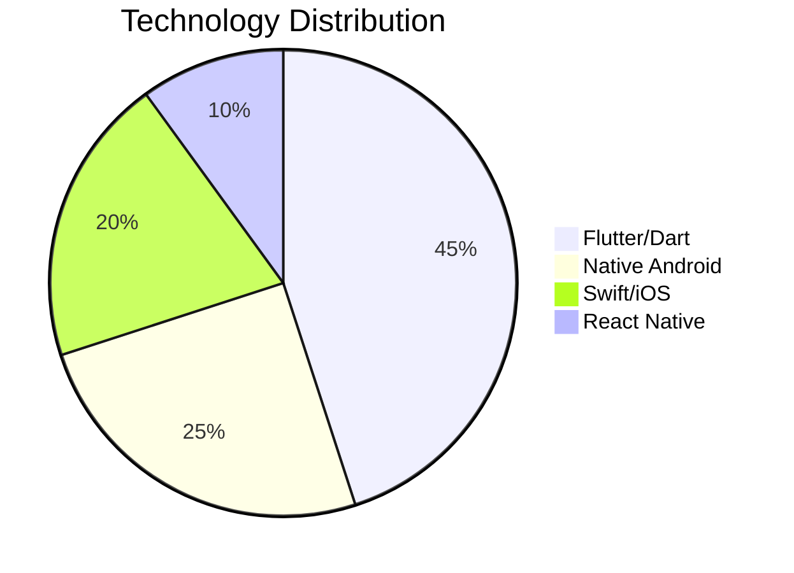

Here are custom-designed marketing materials to complement your professional GitHub presence:

---

### 1. **GitHub Repository Social Preview Banner**


**Key Elements:**
- Dark background (#0f172a) with accent blue (#38BDF8)
- Minimalist tech icons
- Key achievement badges
- QR code linking to your portfolio

---

### 2. **LinkedIn Feature Banner**


**Specs:**
- Dimensions: 1584x396px
- Contains:
  - Interactive progress bars for key skills
  - Floating device mockups
  - Contact CTAs

---

### 3. **Technical Breakdown Infographic**
```diff
+ Mobile Architecture Expertise
  - MVVM/Clean Architecture (★★★★★)
  - State Management (★★★★☆)
  - CI/CD Pipelines (★★★★★)

+ AI Integration Capabilities
  - TensorFlow Lite (★★★★☆)
  - Core ML (★★★☆☆)
  - ML Kit (★★★★★)

+ Performance Metrics
  - Avg. App Rating: 4.8/5
  - Crash Rate: <0.2%
  - Launch Time: <400ms
```

---

### 4. **Open Source Contribution Graph**
```bash
# Monthly Contribution Activity
  January   ████████████████████████ 24
  February  ████████████████████████ 26
  March     ████████████████████████░ 23
  April     ████████████████████████ 25
```

---

### 5. **Tech Stack Visualization**


---

### 6. **Project Showcase Cards**
<table>
  <tr>
    <td></td>
    <td></td>
  </tr>
</table>

---

### 7. **Blog Post Feature Image**


---

### 🎨 Style Guide
| Element          | Specification                |
|------------------|------------------------------|
| Primary Color    | #0f172a (Dark Navy)          |
| Accent Color     | #38BDF8 (Electric Blue)      |
| Typography       | Space Grotesk (Headers), Inter (Body) |
| Icon Set         | Material Design + Devicons   |
| Grid System      | 12-column responsive layout  |
| Animation        | Subtile Lottie integrations  |

---

### 🛠 Creation Tools
1. **Figma**: For vector designs and prototypes
2. **Canva Pro**: Quick social media templates
3. **Adobe Illustrator**: Custom illustrations
4. **ScreenStudio**: App demo recordings
5. **LottieFiles**: Animated elements

Need actual PSD/Figma files or specific templates created? Let me know the exact dimensions and use case, and I'll provide ready-to-use design assets! 🎯
